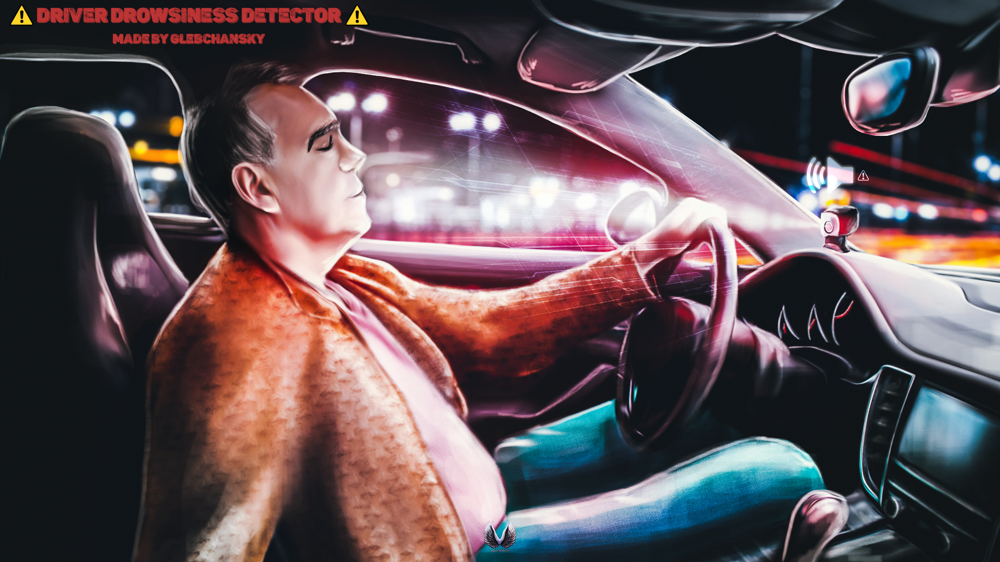

    

  

  

  

  
<h2>Table of contents</h2>

  <ul>
    <li><a href="#overview">Overview</a></li>
    <li><a href="#features">Features</a></li>
    <li><a href="#dependencies">Dependencies</a></li>
    <li><a href="#building">Building</a></li>
  </ul>

## Overview
This project is a thesis work representing a prototype of an intelligent safety system for detecting driver drowsiness
using facial video surveillance.

## Features
- 🚀 [YOLOv5](https://github.com/ultralytics/yolov5) as an object detector
- 🎮 Interactive interaction with the prototype:
  - Start/stop the recognition system
  - Interaction with a video camera
  - Eye and gesture recognition ([V gesture ✌️](#v-gesture), [Fist gesture ✊](#fist-gesture), [Palm gesture ✋](#palm-gesture))
  - Warning of a potential emergency situation using warning sound
- 🚀 Recognition (drowsiness, gestures, etc.) takes approximately one second
- ⚙️ Multi-language user interface
- ⚙️ Cross-platform (Windows/Linux)
- ⚙️ Multithreaded application

## Dependencies (Ninja) TODO
- [C++17](https://en.cppreference.com/w/cpp/17):
  - 64-bit MSVC since version 19.15 on Windows
  - 64-bit GCC since version 11.2 on Linux
- [OpenCV](https://opencv.org/) [4.8.0](https://opencv.org/opencv-4-8-0/)
- [Qt](https://www.qt.io/) [6.5.3](https://doc.qt.io/qt-6.5/)

## Building
TODO: Finalize README
