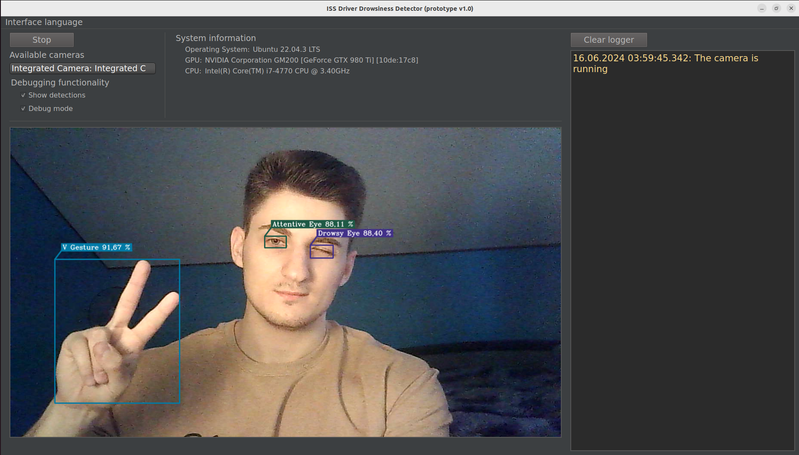

<p align="center">
    
</p>

<div align="center">
  <a href="https://t.me/glebchanskyy">
    
  </a>

  <a href="https://www.instagram.com/glebchansky__">
    
  </a>

  <a href="LICENSE.md">
    
  </a>
</div>

<details open>
  <summary><h2>Table of contents</h2></summary>
  <ul>
    <li><a href="#overview">Overview</a></li>
    <li><a href="#features">Features</a></li>
    <li><a href="#dependencies">Dependencies</a></li>
    <li><a href="#try-it-out">Try it out</a></li>
    <li><a href="#build">Build</a></li>
      <ul>
        <li><a href="#notes-for-linux">Notes for Linux</a></li>
      </ul>
    <li><a href="#limitations">Limitations</a></li>
    <li><a href="#project-screenshots-and-video-snippets">Project screenshots and video snippets</a></li>
      <ul>
        <li><a href="#multi-language-interface">Multi-language interface</a></li>
        <li><a href="#drowsiness-detection">Drowsiness detection</a></li>
        <li><a href="#fist-gesture">Fist gesture</a></li>
        <li><a href="#palm-and-v-gestures">Palm and V gestures</a></li>
        <li><a href="#multiple-cameras">Multiple cameras</a></li>
        <li><a href="#smart-interaction-with-the-camera">Smart interaction with the camera</a></li>
        <li><a href="#cross-platform">Cross-platform</a></li>
      </ul>
  </ul>
</details>

## Overview
This project is a thesis work representing a prototype of an intelligent safety system for detecting driver drowsiness
using facial video surveillance.

## Features
- 🚀 [YOLOv5](https://github.com/ultralytics/yolov5) as an object detector
- 🎮 Interactive interaction with the prototype:
  - Start/stop the recognition system
  - Interaction with a video camera
  - Eye and gesture recognition ([V gesture ✌️](#palm-and-v-gestures), [Fist gesture ✊](#fist-gesture), [Palm gesture ✋](#palm-and-v-gestures))
  - Warning of a potential emergency situation using warning sound
- 🚀 Recognition (drowsiness, gestures, etc.) takes approximately one second
- ⚙️ Multi-language user interface
- ⚙️ Cross-platform (Windows/Linux)
- ⚙️ Multithreaded application

## Dependencies
- [C++17](https://en.cppreference.com/w/cpp/17):
  - 64-bit MSVC 19.15 and higher on Windows
  - 64-bit GCC 11.2 and higher with [Ninja](https://ninja-build.org/) on Linux
- [CMake](https://cmake.org/) 3.21 and higher
- [OpenCV](https://opencv.org/) 4.5.4 and higher
- [Qt](https://www.qt.io/) [6.5.3](https://doc.qt.io/qt-6.5/)
- [NVIDIA drivers](https://www.nvidia.com/download/index.aspx)
- [CUDA](https://developer.nvidia.com/cuda-toolkit-archive) with [cuDNN](https://developer.nvidia.com/rdp/cudnn-archive) (more details about the versions below)

## Try it out
For convenience, [releases](https://github.com/GTruf/Driver-Drowsiness-Detector/releases) with a fully built project with 
all the necessary libraries to run are prepared. On Linux, the **DDDetector** executable is located in the **bin** folder.

The project releases use [CUDA 12.2](https://developer.nvidia.com/cuda-toolkit-archive) with [cuDNN v8.9.2 (for Windows) / v8.9.5 (for Linux) for CUDA 12.x](https://developer.nvidia.com/rdp/cudnn-archive)
(cuDNN libraries are in the release, only CUDA and NVIDIA drivers are mandatory for installation on the computer). 
**For Windows**, everything installs in a few clicks, you just need to download and run the installers from the official 
NVIDIA website. **For Linux** (the project was tested on Ubuntu 22.04) you can use [this instruction](https://gist.github.com/denguir/b21aa66ae7fb1089655dd9de8351a202) 
or others, also take a look at [these notes](#notes-for-linux).

OpenCV libraries have version [4.8.0](https://github.com/opencv/opencv/releases/tag/4.8.0) in the release with support 
for the following GPU architectures: [5.0, 5.2, 6.0, 6.1, 7.0, 7.5, 8.0, 8.6, 8.9, 9.0](https://en.wikipedia.org/wiki/CUDA#GPUs_supported) and require CUDA/cuDNN of 
the versions mentioned above.

## Build
To build and run the project locally, you need to have [Git](https://git-scm.com/downloads), [Python 3.5](https://www.python.org/downloads/) 
and higher, and all necessary [dependencies](#dependencies) installed on your computer. 

#### Notes for Linux
1. Need **binutils** and **OpenGL** packages.
2. On Linux, [RUNPATH is set for the executable](CMakeLists.txt#L85) (libraries are searched for in the **lib64** 
   folder at level with **bin** in the **Qt6**, **opencv**, **cuda** subfolders), so if you want to, you can put framework 
   libraries there, so that the linker will try to find them there first.

From your command line:

```shell
# Clone this repository
git clone https://github.com/GTruf/Driver-Drowsiness-Detector.git

# Go into the repository folder
cd Driver-Drowsiness-Detector

# --------------------------
# Build
# Template: python/python3 build.py --qt-cmake-prefix-path=<path-to-qt-cmake> --opencv-dir=<path-to-directory-containing-cmake-config-for-opencv> -j <thread-number>

# Examples:

# On Windows
> python build.py --qt-cmake-prefix-path=C:\Qt\6.5.3\msvc2019_64\lib\cmake --opencv-dir=C:\Development\opencv-4.8.0\build\install -j 8

# On Linux
$ python3 build.py --qt-cmake-prefix-path=~/Qt/6.5.3/gcc_64/lib/cmake --opencv-dir=/usr/local/lib/cmake/opencv4 -j 8

# Go into the build folder after building the project
cd build

# --------------------------
# Run

# Before running, make sure that all dynamic libraries are located 
# where dynamic library loaders can find them when the executable runs

# On Windows, the executable will be in the build folder and can be opened either via cmd or explorer
> DDDetector.exe

# On Linux, the executable will be in the build/bin folder
$ ./bin/DDDetector
```

## Limitations
1. The camera class when [selecting the camera device](src/Camera.cpp#L31) **on Windows** selects the **DSHOW** 
   (otherwise **MSMF**) API, **on Linux** it selects **V4L2**. In combination, the **MJPEG** video compression method is 
   used. The problem is that not all  video cameras support such combinations, so in the worst case the number of frames 
   per second from the camera can be very small, in this case you need to choose the right API of the camera together with 
   the right video compression method.
2. The repository uses [Git LFS](https://git-lfs.com/) to store some [objects](.gitattributes), so if you can't get something 
   during the `git lfs pull`, you can download them from the releases or [contact me](https://t.me/glebchanskyy), and 
   I'll send them to you personally.

## Project screenshots and video snippets
Just a reminder that you can personally [launch the app](#try-it-out) and try out all of its functionality.

### Multi-language interface
https://github.com/GTruf/Driver-Drowsiness-Detector/assets/61882182/1e977208-e880-4130-b3bf-fdb5786b7d6f

### Drowsiness detection
The drowsiness detection takes about 1-1.25 seconds followed by playing the special warning sound signal. The detection 
is based on the [YOLOv5](https://github.com/ultralytics/yolov5) model trained on a 
[custom dataset](https://universe.roboflow.com/driver-drowsiness-detector/driver-drowsiness-detector) labeled in [Roboflow](https://roboflow.com/).

https://github.com/GTruf/Driver-Drowsiness-Detector/assets/61882182/6001eaf9-6350-44cd-a1d7-1d8b813267b1

### Fist gesture
This gesture is used to restart the recognition system.

https://github.com/GTruf/Driver-Drowsiness-Detector/assets/61882182/f136fb00-e578-4086-b81b-cab753ed7f58

### Palm and V gestures
The **palm** gesture is used to wake up the drowsiness recognition system. The **V** gesture is used to put the drowsiness 
recognition system into sleep mode.

https://github.com/GTruf/Driver-Drowsiness-Detector/assets/61882182/4c09c42f-8297-4522-a44f-749a1b89e433

### Multiple cameras
https://github.com/GTruf/Driver-Drowsiness-Detector/assets/61882182/09ea8c27-c5ff-4f9b-a61d-9111b3ae7581

### Smart interaction with the camera
The application can handle turning off an active camera, no available cameras, and connecting a new camera.

https://github.com/GTruf/Driver-Drowsiness-Detector/assets/61882182/10683440-aeab-4d8f-aa15-a19f68f6010e

### Cross-platform
The application is cross-platform (Windows/Linux). For Linux, it was tested on Ubuntu 22.04.

<p align="center">
    
</p>
